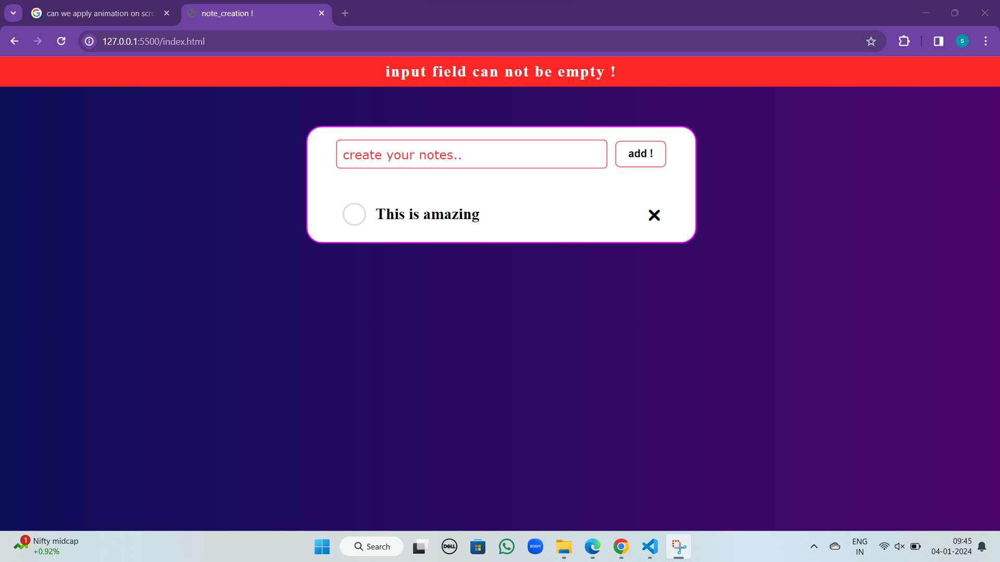

# A note book application where user can **create notes and delete** whenever they want !

## All **notes** store in **localStorage** so that if we close or refresh the page notes will be still available

## If we try to save a note with empty input value it shows error

Topics covered during this mini project :-

- addEventListener
- createElement
- appendChild
- localStorage.setElement
- localStorage.getElement
- setTimeout

### Developer **_Kumar Saurav Saksena_**
